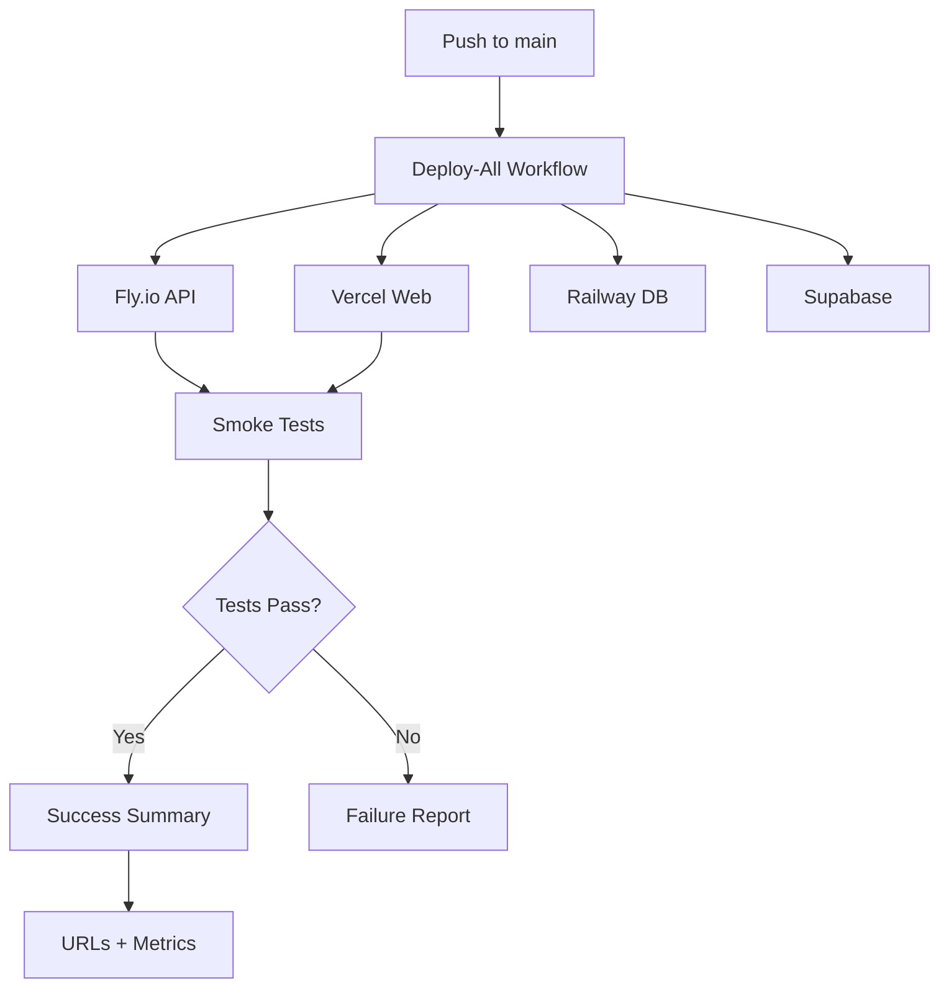

# 🚀 Quick Deployment Guide

**Deploy to Fly.io, Vercel, Railway, and Supabase in 5 minutes**

## Prerequisites

- [ ] GitHub CLI installed: `brew install gh` or [cli.github.com](https://cli.github.com)
- [ ] GitHub CLI authenticated: `gh auth login`
- [ ] Repository access configured

## 1. Validate Secrets (60 seconds)

```bash
# Check if all required secrets are configured
./scripts/validate-secrets.sh
```

**Expected output:**
```
✓ All required secrets are configured! (11/11)
✓ Optional secrets configured: 4/4
🚀 Ready to deploy!
```

**If secrets are missing**, see [GITHUB_ACTIONS_SECRETS_SETUP.md](GITHUB_ACTIONS_SECRETS_SETUP.md) for detailed setup instructions.

## 2. Trigger Deployment (30 seconds)

```bash
# Automated deployment trigger
./scripts/trigger-deploy.sh
```

The script will:
1. ✅ Validate all secrets
2. ✅ Confirm deployment targets
3. ✅ Trigger GitHub Actions workflow
4. ✅ Provide links to monitor progress

**Or trigger manually:**

```bash
gh workflow run deploy-all.yml --ref main
gh run watch
```

## 3. Monitor Progress (3-5 minutes)

Watch the workflow in real-time:

```bash
gh run watch
```

**What happens during deployment:**

1. ✅ Fly.io API deploys (1-2 min)
2. ✅ Vercel Web deploys (1-2 min)
3. ✅ Railway DB migrations run (30 sec)
4. ✅ Supabase Edge Functions deploy (30 sec)
5. 🧪 **Smoke tests run automatically:**
   - API health check
   - Web accessibility test
   - Response time measurement
6. 📊 Summary generated with all URLs

**Or view in browser:**
- Go to: https://github.com/YOUR-ORG/YOUR-REPO/actions
- Click the latest "Deploy ALL Platforms" run

## 4. Verify Deployment (Automatic!)

✨ **Smoke tests run automatically** after deployment:

### Automated Tests
- ✅ **API Health Check**: Verifies `/api/health` returns success
- ✅ **Web Accessibility**: Verifies web app returns HTTP 200
- ✅ **Response Time**: Measures API response time (<2s target)

### Manual Verification (Optional)

**Fly.io API:**
```bash
# Health check
curl https://YOUR-APP-NAME.fly.dev/api/health | jq .

# Expected: {"status":"ok","service":"infamous-freight-api"}
```

### Vercel Web
```bash
# Visit in browser
open https://YOUR-PROJECT.vercel.app

# Or check status
curl -I https://YOUR-PROJECT.vercel.app
```

### Railway Database
```bash
# The workflow automatically runs migrations
# Check the workflow summary for migration status
```

### Supabase
```bash
# Edge functions are automatically deployed
# Smoke tests verify functionality
# Check the workflow summary for deployment status
```

### Deployment Summary

The workflow automatically generates a summary with:
- ✅ Platform deployment statuses
- 🔗 **Actual deployed URLs** (not just dashboards!)
- 🧪 Smoke test results
- ⏱️ Response time metrics
- 🔗 Quick access links to all platforms

## Platform Dashboards

Monitor your deployments:

| Platform | Dashboard URL                                 |
| -------- | --------------------------------------------- |
| Fly.io   | https://fly.io/dashboard                      |
| Vercel   | https://vercel.com/dashboard                  |
| Railway  | https://railway.app/                          |
| Supabase | https://supabase.com/dashboard                |
| GitHub   | https://github.com/YOUR-ORG/YOUR-REPO/actions |

## Deployment Workflow



## What Gets Deployed?

| Platform | Component                      | Config File            |
| -------- | ------------------------------ | ---------------------- |
| Fly.io   | Express API (port 3001)        | `apps/api/fly.toml`    |
| Vercel   | Next.js Web App                | `apps/web/vercel.json` |
| Railway  | Postgres + Prisma Migrations   | Railway project        |
| Supabase | Edge Functions + DB Migrations | `supabase/config.toml` |

## Optional: Deploy Notifications

Get notified when deployments complete! Configure webhook secrets for:

**Quick Setup:**
```bash
# Interactive setup script guides you through the process
./scripts/setup-notifications.sh
```

**What You'll Get:**
- 🎉 Success or ❌ Failure notifications
- Per-platform status (Fly.io, Vercel, Railway, Supabase)
- Smoke test results
- Branch name and commit SHA
- Direct link to GitHub Actions workflow

**Supported Platforms:**
- **Slack**: Posts to any channel in your workspace
- **Discord**: Posts to any channel in your server

**Manual Setup:** See [GITHUB_ACTIONS_SECRETS_SETUP.md](GITHUB_ACTIONS_SECRETS_SETUP.md#setup-notification-webhooks-optional)

**Note:** Notifications are completely optional. Deployments work perfectly without them!

## Troubleshooting

### Secrets Validation Failed
```bash
# Re-run validation with detailed output
./scripts/validate-secrets.sh

# Add missing secrets via GitHub CLI
gh secret set SECRET_NAME

# Or via web UI
open https://github.com/YOUR-ORG/YOUR-REPO/settings/secrets/actions
```

### Workflow Failed
```bash
# View failure logs
gh run view --log

# Re-trigger workflow
./scripts/trigger-deploy.sh
```

### Health Check Failed
```bash
# Check Fly.io logs
flyctl logs -a YOUR-APP-NAME

# Check Fly.io status
flyctl status -a YOUR-APP-NAME

# Restart app
flyctl restart -a YOUR-APP-NAME
```

### Deployment Stuck
```bash
# Cancel running workflow
gh run cancel

# Wait 1 minute, then retry
sleep 60
./scripts/trigger-deploy.sh
```

## Automated vs Manual Deployment

### Automated (Recommended)
```bash
# Push to main branch - auto-deploys
git add .
git commit -m "feat: new feature"
git push origin main
```

### Manual Trigger
```bash
# Deploy without pushing
./scripts/trigger-deploy.sh
```

### Via GitHub UI
1. Actions tab
2. "Deploy ALL Platforms" workflow
3. "Run workflow" button
4. Select branch: `main`
5. Click "Run workflow"

## Post-Deployment Checklist

- [ ] All 4 platforms deployed successfully
- [ ] Health checks passed
- [ ] API responds: `curl https://APP.fly.dev/api/health`
- [ ] Web app loads in browser
- [ ] Database migrations applied
- [ ] Edge functions deployed
- [ ] No errors in logs (first 5 minutes)
- [ ] Team notified (if Slack configured)

## Next Steps

1. **Test critical user flows** in production
2. **Monitor logs** for the first hour:
   ```bash
   flyctl logs -a YOUR-APP-NAME
   vercel logs
   ```
3. **Update documentation** if needed
4. **Notify stakeholders** of deployment

## Quick Links

- **Deployment Status**: https://github.com/YOUR-ORG/YOUR-REPO/actions
- **Secrets Setup Guide**: [GITHUB_ACTIONS_SECRETS_SETUP.md](GITHUB_ACTIONS_SECRETS_SETUP.md)
- **Architecture Overview**: [README.md](README.md)
- **Quick Reference**: [QUICK_REFERENCE.md](QUICK_REFERENCE.md)

---

**Time to Deploy**: ~5 minutes  
**Last Updated**: February 3, 2026  
**Version**: 1.0.0
