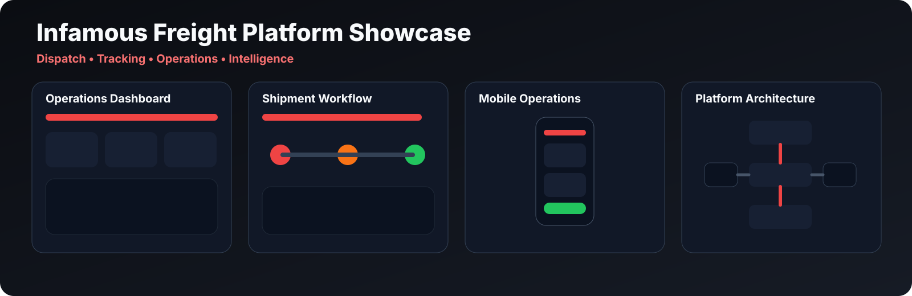
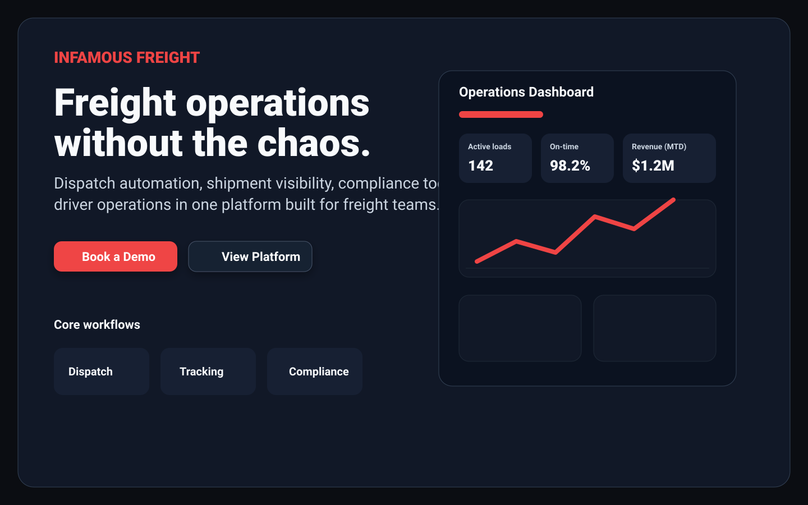
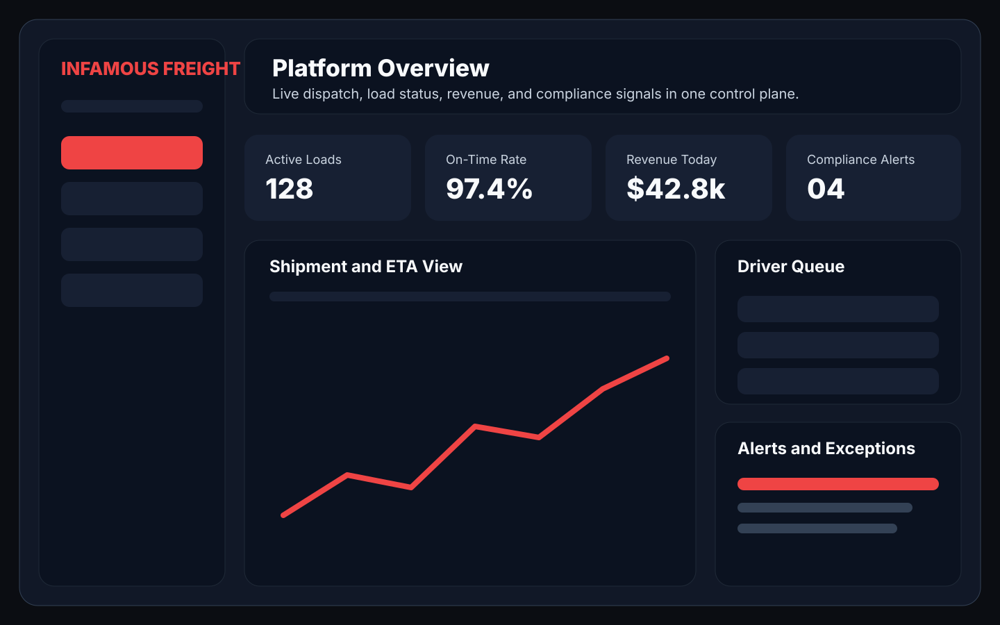

## 📸 Screenshots

  

### 🖥️ Landing Experience

### 📊 Platform Overview

### 🚚 Header Artwork

---

### 🧭 Product UI (Production Screenshots)
<!-- 
  For all the below, 
  replace the placeholder with a real product screenshot.
  Actual files should go in `docs/screenshots/` with the referenced names.
-->

| View                                 | Screenshot (replace placeholder)                                             |
|--------------------------------------|-----------------------------------------------------------------------------|
| Dispatch Board                       |           |
| Shipment Detail View                 |          |
| Driver Operations View               |              |
| Realtime Chat View                   |               |
| Billing / Invoicing View             |         |
| Analytics Dashboard                  |     |
| Compliance Panel                     |        |
| Carrier Packet Workflow              |          |

---
#### 🖼️ Social Preview

> The GitHub social preview image lives at `.github/social-preview.png`. Update using your automation script and upload via Repo Settings as per [branding/README.md](docs/branding/README.md).

---

<!-- End screenshots section -->
