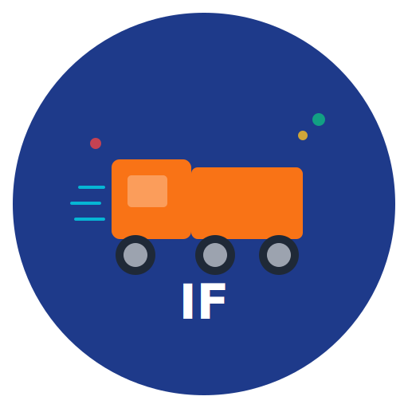

# Infæmous Freight Enterprises - Brand Guidelines

**Version 1.0 | January 2025**

---

## Table of Contents

1. [Brand Identity](#brand-identity)
2. [Logo Usage](#logo-usage)
3. [Color Palette](#color-palette)
4. [Typography](#typography)
5. [Photography Style](#photography-style)
6. [Iconography](#iconography)
7. [Voice & Tone](#voice--tone)
8. [Digital Applications](#digital-applications)
9. [Print Applications](#print-applications)
10. [Brand Don'ts](#brand-donts)

---

## Brand Identity

### Mission Statement

Infæmous Freight Enterprises delivers modern, intelligent logistics solutions that empower businesses to ship smarter, faster, and more reliably. We combine cutting-edge technology with exceptional service to transform the freight industry.

### Brand Attributes

- **Innovative**: Pioneering AI-powered logistics solutions
- **Reliable**: Dependable tracking and delivery commitments
- **Professional**: Enterprise-grade security and service
- **Dynamic**: Fast-moving, adaptive, responsive
- **Approachable**: User-friendly interfaces and support

### Brand Personality

- Forward-thinking but trustworthy
- Technical but accessible
- Fast-paced but precise
- Modern but reliable

---

## Logo Usage

### Primary Logo



**Components:**
- Freight Blue circular background (#1E3A8A)
- Dynamic Orange truck icon (#F97316)
- "IF" company initials in white
- Motion speed lines in cyan

**When to use:**
- Website header
- App splash screen
- Business cards
- Digital marketing
- Social media profiles

### Logo Variations

#### White Logo (Dark Backgrounds)
Use on dark backgrounds where the primary logo doesn't provide sufficient contrast.

#### Black Logo (Light Backgrounds)
Use on light backgrounds or grayscale applications.

#### Monochrome Logo
Use for single-color printing or applications where full color is not available.

#### Icon Only
Use in tight spaces like favicons, app icons, or when brand recognition is already established.

### Clear Space

Maintain clear space equal to the height of the "I" letter around the logo in all directions. No text, graphics, or other elements should encroach on this area.

### Minimum Size

- **Digital**: 32px × 32px (icon only), 120px × 120px (full logo)
- **Print**: 0.5 inch (icon only), 1.5 inches (full logo)

### Logo Don'ts

❌ **Do NOT:**
- Stretch, skew, or distort the logo
- Change the logo colors
- Rearrange logo elements
- Add effects (shadows, glows, gradients not part of the design)
- Place logo on busy backgrounds without sufficient contrast
- Rotate the logo
- Outline the logo
- Use old or unofficial logo versions

✅ **Do:**
- Use official logo files provided in the branding package
- Maintain aspect ratio when resizing
- Ensure adequate contrast with background
- Place logo prominently but tastefully

---

## Color Palette

### Primary Colors

<table>
<tr>
<td>
<strong>Freight Blue</strong><br/>
HEX: #1E3A8A<br/>
RGB: 30, 58, 138<br/>
CMYK: 78, 58, 0, 46<br/>
Use: Primary brand color, backgrounds, headers
</td>
<td style="background: #1E3A8A; width: 100px; height: 100px;"></td>
</tr>

<tr>
<td>
<strong>Dynamic Orange</strong><br/>
HEX: #F97316<br/>
RGB: 249, 115, 22<br/>
CMYK: 0, 54, 91, 2<br/>
Use: CTAs, accents, highlights, interactive elements
</td>
<td style="background: #F97316; width: 100px; height: 100px;"></td>
</tr>

<tr>
<td>
<strong>Professional Gray</strong><br/>
HEX: #1F2937<br/>
RGB: 31, 41, 55<br/>
CMYK: 44, 25, 0, 78<br/>
Use: Body text, secondary elements, borders
</td>
<td style="background: #1F2937; width: 100px; height: 100px;"></td>
</tr>
</table>

### Secondary Colors

<table>
<tr>
<td>
<strong>Success Green</strong><br/>
HEX: #10B981<br/>
RGB: 16, 185, 129<br/>
Use: Success messages, delivered status, positive indicators
</td>
<td style="background: #10B981; width: 80px; height: 80px;"></td>
</tr>

<tr>
<td>
<strong>Warning Yellow</strong><br/>
HEX: #FBBF24<br/>
RGB: 251, 191, 36<br/>
Use: Warnings, delayed status, important notices
</td>
<td style="background: #FBBF24; width: 80px; height: 80px;"></td>
</tr>

<tr>
<td>
<strong>Error Red</strong><br/>
HEX: #EF4444<br/>
RGB: 239, 68, 68<br/>
Use: Errors, failed status, critical alerts
</td>
<td style="background: #EF4444; width: 80px; height: 80px;"></td>
</tr>

<tr>
<td>
<strong>Info Cyan</strong><br/>
HEX: #06B6D4<br/>
RGB: 6, 182, 212<br/>
Use: Information, in-transit status, highlights
</td>
<td style="background: #06B6D4; width: 80px; height: 80px;"></td>
</tr>
</table>

### Neutral Colors

- **White**: #FFFFFF (backgrounds, text on dark)
- **Light Gray**: #F3F4F6 (subtle backgrounds)
- **Medium Gray**: #9CA3AF (secondary text, placeholders)
- **Dark Gray**: #374151 (body text, borders)
- **Black**: #111827 (headings, strong emphasis)

### Color Usage Guidelines

**Web Applications:**
- Use Freight Blue for primary navigation and headers
- Use Dynamic Orange sparingly for CTAs and important actions
- Success/Warning/Error colors only for status indicators
- Maintain WCAG AA contrast ratio (4.5:1 for body text, 3:1 for large text)

**Print Materials:**
- Use CMYK values for accurate color reproduction
- Test print samples before large runs
- Use spot colors (Pantone) for brand-critical applications

---

## Typography

### Primary Typeface: Inter

**Inter** is our primary typeface for all digital and print applications.

- **Headings**: Inter Bold (700)
- **Body Text**: Inter Regular (400)
- **Subheadings**: Inter SemiBold (600)
- **Small Text**: Inter Regular (400)

**Download**: [Google Fonts - Inter](https://fonts.google.com/specimen/Inter)

**Examples:**
```
# Heading 1 - Inter Bold 48px
## Heading 2 - Inter Bold 36px
### Heading 3 - Inter SemiBold 24px

Body text - Inter Regular 16px
Small text - Inter Regular 14px
```

### Secondary Typeface: Fira Code

**Fira Code** is used exclusively for technical content and code samples.

- **Code Blocks**: Fira Code Regular (400)
- **Inline Code**: Fira Code Regular (400)

**Download**: [Google Fonts - Fira Code](https://fonts.google.com/specimen/Fira+Code)

### Font Sizing

**Web:**
- H1: 48px / 3rem
- H2: 36px / 2.25rem
- H3: 24px / 1.5rem
- Body: 16px / 1rem
- Small: 14px / 0.875rem
- Caption: 12px / 0.75rem

**Print:**
- Headline: 36-48pt
- Subheading: 18-24pt
- Body: 10-12pt
- Caption: 8-9pt

### Line Height

- Headings: 1.2
- Body text: 1.6
- Captions: 1.4

### Letter Spacing

- Headings: -0.02em (slight tightening)
- Body: Default (0)
- All caps: 0.05em (slight expansion)

---

## Photography Style

### General Guidelines

**Subject Matter:**
- Logistics operations (warehouses, trucks, packages)
- Technology in action (dashboards, mobile apps, tablets)
- People at work (drivers, warehouse workers, office teams)
- Customer success moments

**Style:**
- Clean, modern, professional
- Natural lighting preferred
- Authentic, not overly staged
- Diverse representation of people
- In-focus subjects with subtle depth of field

**Color Treatment:**
- Vibrant but not oversaturated
- Slight warmth in skin tones
- Blues and oranges complementing brand palette
- Consistent color grading across image sets

### Image Composition

- **Rule of thirds**: Position key subjects at intersections
- **Negative space**: Allow breathing room in compositions
- **Leading lines**: Use roads, warehouse aisles to draw the eye
- **Human element**: Include people to add relatability

### Photography Don'ts

❌ Avoid:
- Stock photos that look overly generic
- Inconsistent lighting or color grades
- Cluttered or distracting backgrounds
- Watermarks or low-resolution images
- Images that don't reflect our brand values

---

## Iconography

### Icon Style

- **Style**: Line icons (2px stroke weight)
- **Shape**: Rounded corners (2px radius)
- **Size**: 24×24px base size
- **Color**: Professional Gray (#1F2937) or Dynamic Orange (#F97316) for interactive states
- **Padding**: 4px internal padding within icon boundaries

### Icon Library

Use icons from **Heroicons** or **Phosphor Icons** for consistency.

**Common Icons:**
- 📦 Package: Shipment/order representation
- 🚚 Truck: Delivery/in-transit status
- 📍 Location Pin: Tracking points
- ✓ Checkmark: Completed/success actions
- ⚠️ Alert Triangle: Warnings
- ❌ X Circle: Errors
- 📊 Chart: Analytics/reports
- 👤 User: Profile/account

### Icon Usage

- Always use icons with accompanying labels for accessibility
- Maintain consistent sizing within a UI group
- Use filled icons for active/selected states
- Use outlined icons for inactive/default states

---

## Voice & Tone

### Brand Voice

Our voice is: **Professional, Knowledgeable, Approachable, Dynamic**

**We sound like:**
- A trusted logistics expert
- A helpful problem solver
- An innovative technology partner
- A reliable team member

**We don't sound like:**
- Overly technical or jargony
- Casual or unprofessional
- Pushy or sales-heavy
- Impersonal or robotic

### Tone Variations

#### Marketing Copy
- Confident and inspiring
- Focus on benefits and outcomes
- Use active voice
- Example: "Ship smarter with AI-powered route optimization"

#### Product UI
- Clear and concise
- Action-oriented
- Helpful and supportive
- Example: "Create your first shipment" (not "Click here to begin")

#### Technical Documentation
- Precise and detailed
- Step-by-step instructions
- Assume moderate technical knowledge
- Example: "Authenticate API requests using JWT tokens in the Authorization header"

#### Customer Support
- Empathetic and patient
- Solution-focused
- Reassuring
- Example: "We're here to help. Let's resolve this together."

### Writing Guidelines

**Do:**
- Use active voice ("We deliver packages" not "Packages are delivered")
- Write in second person ("You can track your shipment")
- Be concise (eliminate unnecessary words)
- Use contractions to sound friendly ("We're" instead of "We are")
- Break up long paragraphs

**Don't:**
- Use jargon without explanation
- Write in passive voice excessively
- Use all caps for emphasis (use bold instead)
- Use exclamation marks excessively
- Make promises you can't keep

---

## Digital Applications

### Website

**Header:**
- Logo: Top left, linked to homepage
- Primary navigation: Top right
- Max width: 1440px, centered

**Hero Section:**
- Large heading (48-60px)
- Supporting text (18-20px)
- Primary CTA (Dynamic Orange button)
- Hero image or animation

**Content Sections:**
- Max width: 1200px for readability
- Generous padding (80-120px vertical)
- Alternating layouts for visual interest

**Footer:**
- Dark background (Freight Blue or Professional Gray)
- White text
- Logo (white version)
- Links to important pages, social media

### Mobile App

**Navigation:**
- Bottom tab bar for primary navigation
- Top navigation bar for page titles and actions
- Standard iOS/Android patterns

**Colors:**
- Status bar: Freight Blue
- Active tabs: Dynamic Orange
- Backgrounds: White or Light Gray
- Text: Dark Gray or Black

**Touch Targets:**
- Minimum 44×44pts (iOS) / 48×48dp (Android)
- Adequate spacing between interactive elements

### Email Design

**Header:**
- Logo centered or left-aligned
- Preheader text (50-100 characters)
- Mobile-responsive (stacks on small screens)

**Body:**
- Single column layout
- Max width 600px
- Body text 14-16px
- Line height 1.6
- Primary CTA button (Dynamic Orange, 48px height)

**Footer:**
- Unsubscribe link (required)
- Company address
- Social media links
- Small logo

---

## Print Applications

### Business Cards

**Dimensions:** 3.5" × 2" (standard)

**Front:**
- Logo (left or center)
- Name and title
- Company name

**Back:**
- Contact information (phone, email, address)
- Website URL
- QR code (optional)

**Paper Stock:** 16pt cardstock, matte or glossy finish

### Letterhead

**Dimensions:** 8.5" × 11" (US Letter)

**Header:**
- Logo (top left, 1" from top, 0.75" from left)
- Company address (top right, 11pt)

**Footer:**
- Tagline or website URL
- Legal information if required

### Business Documents

**Presentations:**
- Title slide with logo
- Section dividers with brand colors
- Content slides with consistent layouts
- Footer with page numbers

**Reports:**
- Cover page with logo and title
- Table of contents
- Consistent heading hierarchy
- Charts and graphs using brand colors

---

## Brand Don'ts

### Logo Misuse

❌ **Never:**
1. Stretch or distort the logo
2. Change logo colors
3. Rotate the logo
4. Apply effects (drop shadows, glows)
5. Place logo on busy backgrounds
6. Use low-resolution logo files
7. Recreate the logo from scratch
8. Use outdated logo versions

### Color Misuse

❌ **Never:**
1. Substitute brand colors with similar shades
2. Use non-brand colors for primary elements
3. Ignore contrast guidelines (WCAG)
4. Print RGB colors without CMYK conversion
5. Use too many colors at once (stick to 2-3)

### Typography Misuse

❌ **Never:**
1. Substitute Inter with Arial, Helvetica, or similar
2. Use decorative fonts for body text
3. Set body text smaller than 14px (web) or 10pt (print)
4. Use all caps for large blocks of text
5. Stretch or condense type

### Content Misuse

❌ **Never:**
1. Use inconsistent voice and tone
2. Make claims without data to back them up
3. Speak negatively about competitors
4. Use offensive or exclusionary language
5. Ignore accessibility best practices

---

## Accessibility Guidelines

### Color Contrast

- **Body text (16px):** Minimum 4.5:1 contrast ratio
- **Large text (18px+ or 14px+ bold):** Minimum 3:1 contrast ratio
- **Interactive elements:** Minimum 3:1 contrast ratio

**Tools:**
- [WebAIM Contrast Checker](https://webaim.org/resources/contrastchecker/)
- [Colour Contrast Analyser](https://www.tpgi.com/color-contrast-checker/)

### Alt Text

Provide descriptive alt text for all images:
- Describe the content and context
- Keep it concise (125 characters or less)
- Don't start with "Image of..." (screen readers announce this)
- Decorative images: Use empty alt attribute (alt="")

**Example:**
```html

```

### Focus States

- Clearly visible focus indicators for keyboard navigation
- Outline width: Minimum 2px
- Outline color: High contrast with background (Dynamic Orange on light, white on dark)

---

## Brand Approval Process

### Internal Use

All internal uses of brand assets are automatically approved when following these guidelines.

### External Use

For partner marketing, co-branding, or any external use of Infæmous Freight branding:

1. **Request Approval:** Email marketing@infamousfreight.com
2. **Submit Materials:** Provide mockups or draft materials
3. **Review Process:** 3-5 business days
4. **Approval/Feedback:** Receive approval or revision requests
5. **Final Sign-off:** Obtain written approval before publication

---

## Brand Resources

### Download Brand Assets

All brand assets are available in the `/media/branding` directory:

- **Logos:** `/media/branding/logo/`
- **Color Swatches:** `/media/branding/colors/`
- **Typography:** `/media/branding/fonts/`
- **Icons:** `/media/branding/icons/`
- **Templates:** `/media/branding/templates/`

### Brand Toolkit

Request the complete brand toolkit (includes Adobe Illustrator, Figma, and PowerPoint templates) from the marketing team.

### Questions?

For brand guideline questions, contact:
- **Email:** brand@infamousfreight.com
- **Slack:** #brand-guidelines

---

## Revision History

| Version | Date | Changes | Author |
|---------|------|---------|--------|
| 1.0 | January 2025 | Initial release | Marketing Team |

---

**© 2025 Infæmous Freight Enterprises. All rights reserved.**
