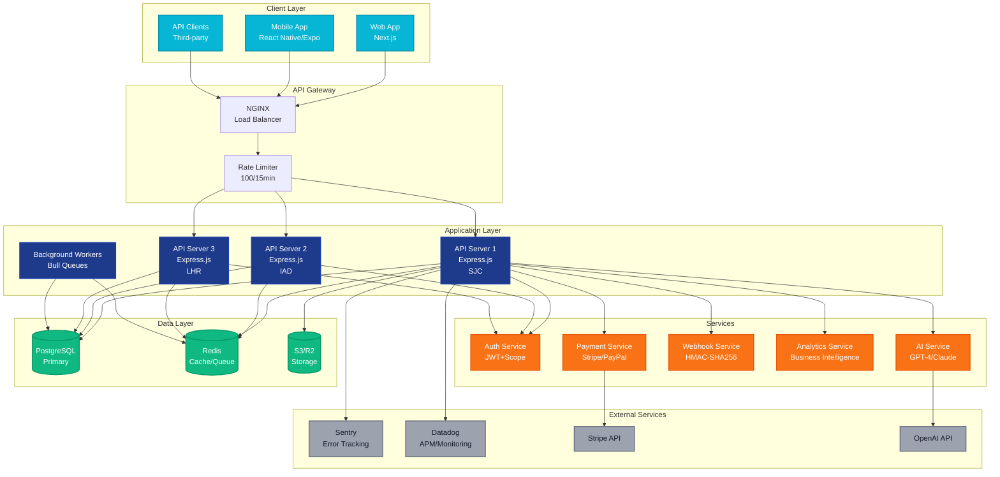
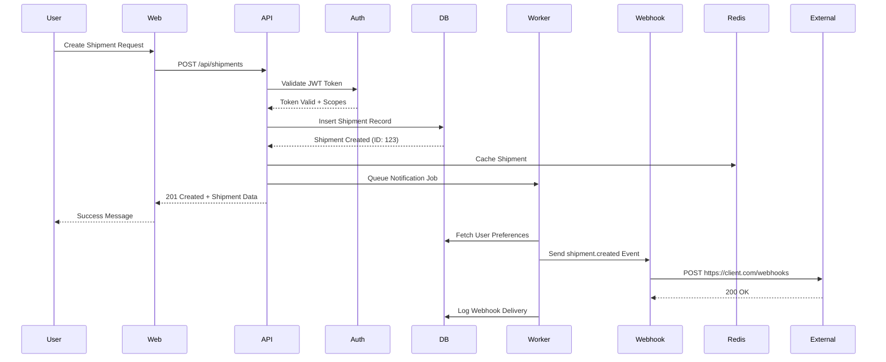
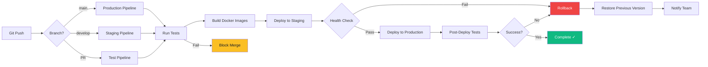
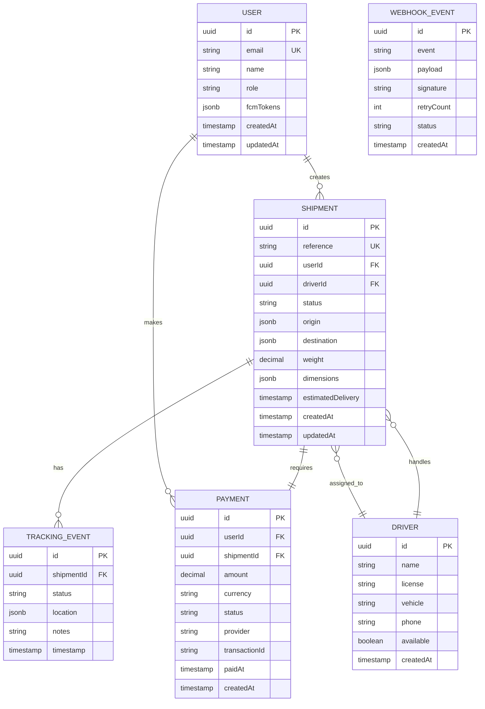
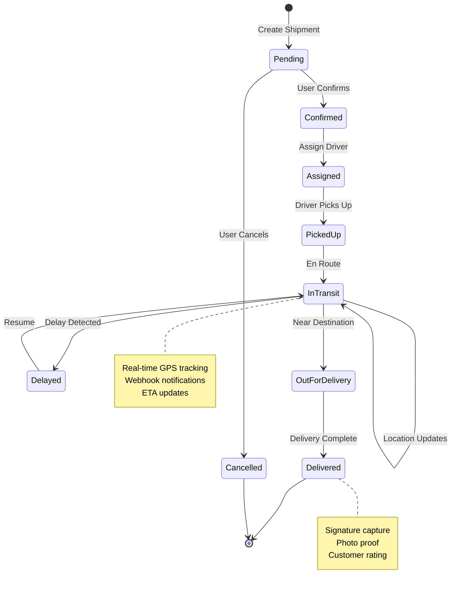
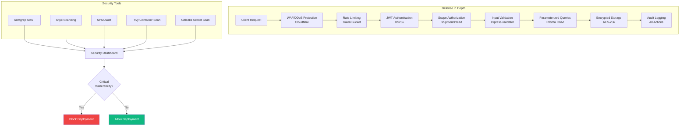

# System Architecture Diagram - Infæmous Freight Enterprises

## Architecture Components

### Client Layer
- **Web App:** Next.js 14 with TypeScript, deployed on Vercel
- **Mobile App:** React Native/Expo, iOS and Android
- **API Clients:** Third-party integrations via REST API

### API Gateway
- **NGINX:** Load balancer and reverse proxy
- **Rate Limiter:** Token bucket algorithm (100 req/15min general)

### Application Layer
- **API Servers:** 3 regions (San Jose, Virginia, London)
- **Background Workers:** Bull queues for async processing

### Services
- **Auth:** JWT with scope-based authorization
- **AI:** OpenAI GPT-4 or Anthropic Claude
- **Webhooks:** HMAC-SHA256 signing
- **Analytics:** Real-time business intelligence
- **Payments:** Stripe and PayPal integration

### Data Layer
- **PostgreSQL:** Primary relational database
- **Redis:** Caching and queue backing
- **S3/R2:** Object storage for files

### External Services
- **Sentry:** Error tracking and monitoring
- **Datadog:** APM and observability
- **Stripe:** Payment processing
- **OpenAI:** AI capabilities

---

# Data Flow Diagram

---

# CI/CD Pipeline Diagram

---

# Database Entity Relationship Diagram

---

# Shipment Lifecycle Flow

---

# Security Architecture

---

These diagrams can be rendered using:
- **GitHub Markdown:** Automatically renders Mermaid
- **VS Code:** Mermaid Preview extension
- **Mermaid Live Editor:** https://mermaid.live
- **Documentation Sites:** Docusaurus, Vitepress, etc.
